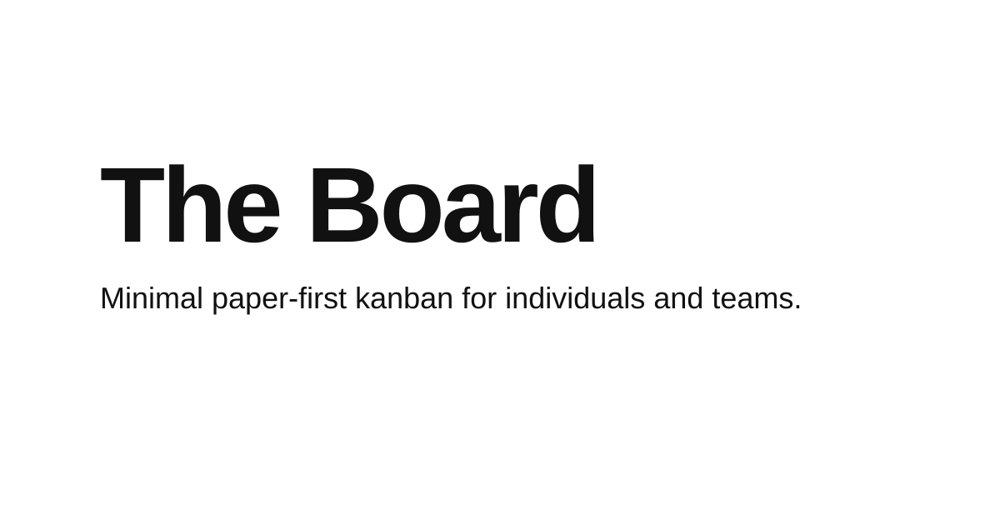

<p align="center">
  
</p>

<p align="center">
  <a href="LICENSE"></a>
  
  <a href="https://www.npmjs.com/package/@iamkaf/board"></a>
</p>

<h1 align="center">board</h1>

<p align="center">
  <strong>A zero-dependency CLI for interacting with <a href="https://board.kaf.sh">The Board</a> from your terminal.</strong>
</p>

---

board provides browser-based login and manages card and board flows for [The Board](https://board.kaf.sh) directly from the command line without heavy third-party dependencies.

## Quick Start

### Install

```bash
npm install -g @iamkaf/board
```

*(You can also use `npx @iamkaf/board` to run without installing globally.)*

### Authenticate

```bash
board login
```

This opens `board.kaf.sh` in your browser, asks you to approve CLI access, and securely stores the token locally.

## Usage

### Authentication & Config

| Command | Description |
|---------|-------------|
| `board login` | Authenticate via browser |
| `board logout` | Remove the local CLI token |
| `board auth status` | Check current authentication status |
| `board auth set-token <token>` | Manually configure a Personal Access Token (PAT) |
| `board auth set-base-url <url>` | Point the CLI at a different API base URL |
| `board info` | View API information |

The CLI stores local config in `~/.config/board/config.json`. You can override these using environment variables:

- `BOARD_TOKEN`
- `BOARD_BASE_URL`

### Boards

| Command | Description |
|---------|-------------|
| `board boards list` | List available boards (use `--json` for scripting) |
| `board boards get <board-id>` | Get details for a specific board |

### Cards

Cards can be targeted by internal ID (`crd_...`) or public code (`BRD-29`).

| Command | Description |
|---------|-------------|
| `board cards get <board-id> <card-id>` | View card details |
| `board cards create <board-id> --list <list-id> --title <text> [options]` | Create a new card |
| `board cards update <board-id> <card-id> [options]` | Update an existing card |
| `board cards move <board-id> <card-id> --list <list-id> --index <num>` | Move a card to a different list |
| `board cards comment <board-id> <card-id> --message <text>` | Add a comment to a card |

**Card Options:**

| Option | Actions | Description |
|--------|---------|-------------|
| Title | `--title <text>` | Set the card title |
| Description | `--description <text>` | Set the card description |
| Label | `--label <id>`, `--clear-labels` | Modify or clear labels |
| Assignee | `--assignee <id>`, `--clear-assignee` | Modify or clear assignee |
| Epic | `--epic <id>`, `--clear-epic` | Modify or clear epic |
| Due Date | `--due-at <iso-or-ms>`, `--clear-due-at` | Modify or clear due date |

## Development

```bash
npm install
npm run build
npm test
```

## License

[MIT](LICENSE)
